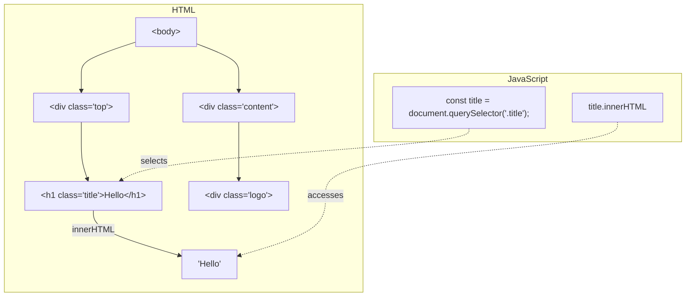
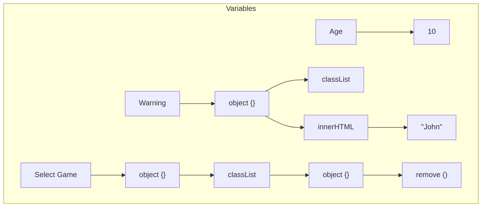

# DOM manipulation and classList

## Section: DOM manipulation

### Summary
- To manipulate an element of your HTML using JavaScript, the first step is, in JavaScript, to find this HTML element
- To do this, the browser provides your JavaScript with a variable called `document`, which has several useful functions to manipulate your HTML document
- For example, a function inside `document` is `querySelector`, which allows you to find HTML elements using selectors similar to the ones we used in CSS
- When the HTML is loaded in the browser, it creates the **HTML DOM** (Document Object Model) where the elements are organized hierarchically like a tree. The JavaScript has access to the DOM through the **document** variable and can search for an element through the **querySelector**. With **innerHTML** we can change the value of the searched element.

- To find an element that has a class top for example, we could do this:
```jsx
const element = document.querySelector(".top");
```
- The function `querySelector` returns a reference to your HTML element, which, like the `document` variable, has several functions and useful values to manipulate your element
- For example, we can retrieve the text inside the element using the `innerHTML` property of the element:
```jsx
<div class="top">My top</div>

<script>
  const element = document.querySelector(".top");
  alert(element.innerHTML); // Will show alert with the text "My top"
</script>
```
- Besides getting the text of an element, we can also change it. To do this, just use the assignment operator (`=`) as if it were a variable:  
```jsx
const element = document.querySelector(".top");
element.innerHTML = "New text";
```
- We can also put the value stored in a variable inside an element:
```jsx
const name = prompt("What is your name?");
const element = document.querySelector(".welcome");
element.innerHTML = "Welcome, " + name;
```
- Another way to write a string using the values of other variables are the *template string*:
```jsx
const name = prompt("What is your name?");
const element = document.querySelector(".welcome");
element.innerHTML = `Welcome, ${name}`;
```

### Project: New Users
You are very excited about the new users of your site and created a welcome page that calls them by name!

Create a welcome generator that asks the user's name via `prompt` and displays it in the `div` with the class `welcome` with the text `"Hello, [name here]!"` where `[name here]` is the user's name.

```html
<!DOCTYPE html>
<html lang="en">
  <head>
    <meta charset="UTF-8" />
    <meta name="viewport" content="width=device-width, initial-scale=1.0" />
    <title>Hello</title>
    <!-- css below -->
    <link rel="stylesheet" type="text/css" href="nyan.css" />
    <style>
      body {
        display: flex;
        flex-direction: column;
        justify-content: center;
        align-items: center;
      }

      h1 {
        color: white;
      }
    </style>
  </head>
  <body>
    <h1>Welcome!</h1>
    <div class="nyan-cat nyan-size"></div>
    <div class="welcome"></div>
  </body>
</html>
```

```css
body {
  background: #1c4170;
}

/* use this to adjust the size of your nyan-cat (Whole values only) */
.nyan-size {
  font-size: 5px;
}

/* animations */
@-webkit-keyframes catMove {
  0% {
    -webkit-transform: translate(0, 0);
  }
  25% {
    -webkit-transform: translate(5em, 0);
  }
  50% {
    -webkit-transform: translate(5em, 5em);
  }
  75% {
    -webkit-transform: translate(0, 5em);
  }
  100% {
    -webkit-transform: translate(0, 0);
  }
}

/* grrr maybe someday you'll be able to animate 
pseudo elements independent of the parent. 

Oh well, I guess I can still just animate the 
parent element via box shadow...if you could 
parent & animate it would make it worth it */
@-webkit-keyframes headMove {
  0% {
    top: 7em;
    left: 20em;
  }
  25% {
    top: 6em;
    left: 20em;
  }
  50% {
    top: 6em;
    left: 21em;
  }
  75% {
    top: 7em;
    left: 21em;
  }
  100% {
    top: 7em;
    left: 20em;
  }
}

.nyan-cat,
.nyan-cat:before,
.nyan-cat:after {
  height: 1em;
  width: 1em; /* ratio of each "pixel" */

  /* fixes edges for solid color, makes the 
  corners a little wonky Grrrr  I checked
  using a SCSS conditional but it does not complile 
  the animations correctly. So bugs remain Sadface.*/

  padding: 1px;
  transform: translateZ(
    0
  ); /* hack forces hardware acceleration which is kind of needed*/

  /* Any individual "pixel" effects are applied here */
  /*
  border-radius:1em; 
  /* so it's easier to just close the comment above...#lazyDeveloper */
}

.nyan-cat:before,
.nyan-cat:after {
  content: "";
  position: absolute;
}

/*the Poptart */
.nyan-cat {
  /* nyan-cat positioning */
  position: absolute;
  top: 50px;
  right: 250px;

  -webkit-animation-timing-function: step-start;
  -webkit-animation: catMove 500ms infinite;

  /* the poptart */
  box-shadow: 10em 0 #000, 11em 0 #000, 12em 0 #000, 13em 0 #000, 14em 0 #000,
    15em 0 #000, 16em 0 #000, 17em 0 #000, 18em 0 #000, 19em 0 #000, 20em 0 #000,
    21em 0 #000, 22em 0 #000, 23em 0 #000, 24em 0 #000, 25em 0 #000, 26em 0 #000,
    27em 0 #000, 28em 0 #000, 29em 0 #000, 9em 1em #000, 10em 1em #ffcc99,
    11em 1em #ffcc99, 12em 1em #ffcc99, 13em 1em #ffcc99, 14em 1em #ffcc99,
    15em 1em #ffcc99, 16em 1em #ffcc99, 17em 1em #ffcc99, 18em 1em #ffcc99,
    19em 1em #ffcc99, 20em 1em #ffcc99, 21em 1em #ffcc99, 22em 1em #ffcc99,
    23em 1em #ffcc99, 24em 1em #ffcc99, 25em 1em #ffcc99, 26em 1em #ffcc99,
    27em 1em #ffcc99, 28em 1em #ffcc99, 29em 1em #ffcc99, 30em 1em #000,
    8em 2em #000, 9em 2em #ffcc99, 10em 2em #ffcc99, 11em 2em #ffcc99,
    12em 2em #ffa2f8, 13em 2em #ffa2f8, 14em 2em #ffa2f8, 15em 2em #ffa2f8,
    16em 2em #ffa2f8, 17em 2em #ffa2f8, 18em 2em #ffa2f8, 19em 2em #ffa2f8,
    20em 2em #ffa2f8, 21em 2em #ffa2f8, 22em 2em #ffa2f8, 23em 2em #ffa2f8,
    24em 2em #ffa2f8, 25em 2em #ffa2f8, 26em 2em #ffa2f8, 27em 2em #ffa2f8,
    28em 2em #ffcc99, 29em 2em #ffcc99, 30em 2em #ffcc99, 31em 2em #000,
    8em 3em #000, 9em 3em #ffcc99, 10em 3em #ffcc99, 11em 3em #ffa2f8,
    12em 3em #ffa2f8, 13em 3em #ffa2f8, 14em 3em #ffa2f8, 15em 3em #ffa2f8,
    16em 3em #ffa2f8, 17em 3em #ffa2f8, 18em 3em #ff45ab, 19em 3em #ff45ab,
    20em 3em #ffa2f8, 21em 3em #ffa2f8, 22em 3em #ffa2f8, 23em 3em #ff45ab,
    24em 3em #ffa2f8, 25em 3em #ffa2f8, 26em 3em #ffa2f8, 27em 3em #ffa2f8,
    28em 3em #ffa2f8, 29em 3em #ffcc99, 30em 3em #ffcc99, 31em 3em #000,
    8em 4em #000, 9em 4em #ffcc99, 10em 4em #ffa2f8, 11em 4em #ffa2f8,
    12em 4em #ff45ab, 13em 4em #ffa2f8, 14em 4em #ffa2f8, 15em 4em #ffa2f8,
    16em 4em #ffa2f8, 17em 4em #ffa2f8, 18em 4em #ff45ab, 19em 4em #ff45ab,
    20em 4em #ffa2f8, 21em 4em #ffa2f8, 22em 4em #ffa2f8, 23em 4em #ff45ab,
    24em 4em #ffa2f8, 25em 4em #ffa2f8, 26em 4em #ffa2f8, 27em 4em #ffa2f8,
    28em 4em #ffa2f8, 29em 4em #ffa2f8, 30em 4em #ffcc99, 31em 4em #000,
    8em 5em #000, 9em 5em #ffcc99, 10em 5em #ffa2f8, 11em 5em #ffa2f8,
    12em 5em #ffa2f8, 13em 5em #ffa2f8, 14em 5em #ffa2f8, 15em 5em #ffa2f8,
    16em 5em #ffa2f8, 17em 5em #ffa2f8, 18em 5em #ffa2f8, 19em 5em #ffa2f8,
    20em 5em #ffa2f8, 21em 5em #ffa2f8, 22em 5em #ffa2f8, 23em 5em #ffa2f8,
    24em 5em #ffa2f8, 25em 5em #ffa2f8, 26em 5em #ffa2f8, 27em 5em #ffa2f8,
    28em 5em #ffa2f8, 29em 5em #ffa2f8, 30em 5em #ffcc99, 31em 5em #000,
    8em 6em #000, 9em 6em #ffcc99, 10em 6em #ffa2f8, 11em 6em #ffa2f8,
    12em 6em #ffa2f8, 13em 6em #ffa2f8, 14em 6em #ffa2f8, 15em 6em #ffa2f8,
    16em 6em #ffa2f8, 17em 6em #ffa2f8, 18em 6em #ffa2f8, 19em 6em #ffa2f8,
    20em 6em #ffa2f8, 21em 6em #ffa2f8, 22em 6em #ffa2f8, 23em 6em #ffa2f8,
    24em 6em #ffa2f8, 25em 6em #ffa2f8, 26em 6em #ff45ab, 27em 6em #ffa2f8,
    28em 6em #ffa2f8, 29em 6em #ffa2f8, 30em 6em #ffcc99, 31em 6em #000,
    8em 7em #000, 9em 7em #ffcc99, 10em 7em #ffa2f8, 11em 7em #ffa2f8,
    12em 7em #ffa2f8, 13em 7em #ffa2f8, 14em 7em #ffa2f8, 15em 7em #ffa2f8,
    16em 7em #ffa2f8, 17em 7em #ffa2f8, 18em 7em #ffa2f8, 19em 7em #ffa2f8,
    20em 7em #ffa2f8, 21em 7em #ffa2f8, 22em 7em #ffa2f8, 23em 7em #ffa2f8,
    24em 7em #ffa2f8, 25em 7em #ffa2f8, 26em 7em #ffa2f8, 27em 7em #ffa2f8,
    28em 7em #ffa2f8, 29em 7em #ffa2f8, 30em 7em #ffcc99, 31em 7em #000,
    8em 8em #000, 9em 8em #ffcc99, 10em 8em #ffa2f8, 11em 8em #ffa2f8,
    12em 8em #ffa2f8, 13em 8em #ffa2f8, 14em 8em #ffa2f8, 15em 8em #ffa2f8,
    16em 8em #ffa2f8, 17em 8em #ff45ab, 18em 8em #ffa2f8, 19em 8em #ffa2f8,
    20em 8em #ffa2f8, 21em 8em #ffa2f8, 22em 8em #ffa2f8, 23em 8em #ffa2f8,
    24em 8em #ffa2f8, 25em 8em #ffa2f8, 26em 8em #ffa2f8, 27em 8em #ffa2f8,
    28em 8em #ffa2f8, 29em 8em #ffa2f8, 30em 8em #ffcc99, 31em 8em #000,
    8em 9em #000, 9em 9em #ffcc99, 10em 9em #ffa2f8, 11em 9em #ffa2f8,
    12em 9em #ffa2f8, 13em 9em #ffa2f8, 14em 9em #ffa2f8, 15em 9em #ffa2f8,
    16em 9em #ffa2f8, 17em 9em #ffa2f8, 18em 9em #ffa2f8, 19em 9em #ffa2f8,
    20em 9em #ffa2f8, 21em 9em #ffa2f8, 22em 9em #ffa2f8, 23em 9em #ffa2f8,
    24em 9em #ffa2f8, 25em 9em #ffa2f8, 26em 9em #ffa2f8, 27em 9em #ffa2f8,
    28em 9em #ffa2f8, 29em 9em #ffa2f8, 30em 9em #ffcc99, 31em 9em #000,
    8em 10em #000, 9em 10em #ffcc99, 10em 10em #ffa2f8, 11em 10em #ffa2f8,
    12em 10em #ffa2f8, 13em 10em #ff45ab, 14em 10em #ffa2f8, 15em 10em #ffa2f8,
    16em 10em #ffa2f8, 17em 10em #ffa2f8, 18em 10em #ffa2f8, 19em 10em #ffa2f8,
    20em 10em #ffa2f8, 21em 10em #ffa2f8, 22em 10em #ffa2f8, 23em 10em #ffa2f8,
    24em 10em #ffa2f8, 25em 10em #ffa2f8, 26em 10em #ffa2f8, 27em 10em #ffa2f8,
    28em 10em #ffa2f8, 29em 10em #ffa2f8, 30em 10em #ffcc99, 31em 10em #000,
    8em 11em #000, 9em 11em #ffcc99, 10em 11em #ffa2f8, 11em 11em #ffa2f8,
    12em 11em #ffa2f8, 13em 11em #ffa2f8, 14em 11em #ffa2f8, 15em 11em #ffa2f8,
    16em 11em #ffa2f8, 17em 11em #ffa2f8, 18em 11em #ffa2f8, 19em 11em #ff45ab,
    20em 11em #ffa2f8, 21em 11em #ffa2f8, 22em 11em #ffa2f8, 23em 11em #ffa2f8,
    24em 11em #ffa2f8, 25em 11em #ffa2f8, 26em 11em #ffa2f8, 27em 11em #ffa2f8,
    28em 11em #ffa2f8, 29em 11em #ffa2f8, 30em 11em #ffcc99, 31em 11em #000,
    8em 12em #000, 9em 12em #ffcc99, 10em 12em #ffa2f8, 11em 12em #ffa2f8,
    12em 12em #ffa2f8, 13em 12em #ffa2f8, 14em 12em #ffa2f8, 15em 12em #ffa2f8,
    16em 12em #ffa2f8, 17em 12em #ffa2f8, 18em 12em #ffa2f8, 19em 12em #ffa2f8,
    20em 12em #ffa2f8, 21em 12em #ffa2f8, 22em 12em #ffa2f8, 23em 12em #ffa2f8,
    24em 12em #ffa2f8, 25em 12em #ffa2f8, 26em 12em #ffa2f8, 27em 12em #ffa2f8,
    28em 12em #ffa2f8, 29em 12em #ffa2f8, 30em 12em #ffcc99, 31em 12em #000,
    8em 13em #000, 9em 13em #ffcc99, 10em 13em #ffa2f8, 11em 13em #ff45ab,
    12em 13em #ffa2f8, 13em 13em #ffa2f8, 14em 13em #ffa2f8, 15em 13em #ffa2f8,
    16em 13em #ffa2f8, 17em 13em #ffa2f8, 18em 13em #ffa2f8, 19em 13em #ffa2f8,
    20em 13em #ffa2f8, 21em 13em #ffa2f8, 22em 13em #ffa2f8, 23em 13em #ffa2f8,
    24em 13em #ffa2f8, 25em 13em #ffa2f8, 26em 13em #ffa2f8, 27em 13em #ffa2f8,
    28em 13em #ffa2f8, 29em 13em #ffa2f8, 30em 13em #ffcc99, 31em 13em #000,
    8em 14em #000, 9em 14em #ffcc99, 10em 14em #ffa2f8, 11em 14em #ffa2f8,
    12em 14em #ffa2f8, 13em 14em #ffa2f8, 14em 14em #ffa2f8, 15em 14em #ffa2f8,
    16em 14em #ffa2f8, 17em 14em #ffa2f8, 18em 14em #ff45ab, 19em 14em #ffa2f8,
    20em 14em #ffa2f8, 21em 14em #ffa2f8, 22em 14em #ffa2f8, 23em 14em #ffa2f8,
    24em 14em #ffa2f8, 25em 14em #ffa2f8, 26em 14em #ffa2f8, 27em 14em #ffa2f8,
    28em 14em #ffa2f8, 29em 14em #ffa2f8, 30em 14em #ffcc99, 31em 14em #000,
    8em 15em #000, 9em 15em #ffcc99, 10em 15em #ffa2f8, 11em 15em #ffa2f8,
    12em 15em #ffa2f8, 13em 15em #ffa2f8, 14em 15em #ffa2f8, 15em 15em #ffa2f8,
    16em 15em #ffa2f8, 17em 15em #ffa2f8, 18em 15em #ffa2f8, 19em 15em #ffa2f8,
    20em 15em #ffa2f8, 21em 15em #ffa2f8, 22em 15em #ffa2f8, 23em 15em #ffa2f8,
    24em 15em #ffa2f8, 25em 15em #ffa2f8, 26em 15em #ffa2f8, 27em 15em #ff45ab,
    28em 15em #ffa2f8, 29em 15em #ffa2f8, 30em 15em #ffcc99, 31em 15em #000,
    8em 16em #000, 9em 16em #ffcc99, 10em 16em #ffa2f8, 11em 16em #ffa2f8,
    12em 16em #ffa2f8, 13em 16em #ffa2f8, 14em 16em #ffa2f8, 15em 16em #ff45ab,
    16em 16em #ffa2f8, 17em 16em #ffa2f8, 18em 16em #ffa2f8, 19em 16em #ffa2f8,
    20em 16em #ffa2f8, 21em 16em #ff45ab, 22em 16em #ffa2f8, 23em 16em #ffa2f8,
    24em 16em #ffa2f8, 25em 16em #ffa2f8, 26em 16em #ffa2f8, 27em 16em #ffa2f8,
    28em 16em #ffa2f8, 29em 16em #ffa2f8, 30em 16em #ffcc99, 31em 16em #000,
    8em 17em #000, 9em 17em #ffcc99, 10em 17em #ffa2f8, 11em 17em #ffa2f8,
    12em 17em #ffa2f8, 13em 17em #ffa2f8, 14em 17em #ffa2f8, 15em 17em #ffa2f8,
    16em 17em #ffa2f8, 17em 17em #ffa2f8, 18em 17em #ffa2f8, 19em 17em #ffa2f8,
    20em 17em #ffa2f8, 21em 17em #ffa2f8, 22em 17em #ffa2f8, 23em 17em #ffa2f8,
    24em 17em #ffa2f8, 25em 17em #ffa2f8, 26em 17em #ffa2f8, 27em 17em #ffa2f8,
    28em 17em #ffa2f8, 29em 17em #ffa2f8, 30em 17em #ffcc99, 31em 17em #000,
    8em 18em #000, 9em 18em #ffcc99, 10em 18em #ffcc99, 11em 18em #ffcc99,
    12em 18em #ffa2f8, 13em 18em #ffa2f8, 14em 18em #ffa2f8, 15em 18em #ffa2f8,
    16em 18em #ffa2f8, 17em 18em #ffa2f8, 18em 18em #ffa2f8, 19em 18em #ffa2f8,
    20em 18em #ffa2f8, 21em 18em #ffa2f8, 22em 18em #ffa2f8, 23em 18em #ffa2f8,
    24em 18em #ffa2f8, 25em 18em #ffa2f8, 26em 18em #ffa2f8, 27em 18em #ffa2f8,
    28em 18em #ffcc99, 29em 18em #ffcc99, 30em 18em #ffcc99, 31em 18em #000,
    9em 19em #000, 10em 19em #ffcc99, 11em 19em #ffcc99, 12em 19em #ffcc99,
    13em 19em #ffcc99, 14em 19em #ffcc99, 15em 19em #ffcc99, 16em 19em #ffcc99,
    17em 19em #ffcc99, 18em 19em #ffcc99, 19em 19em #ffcc99, 20em 19em #ffcc99,
    21em 19em #ffcc99, 22em 19em #ffcc99, 23em 19em #ffcc99, 24em 19em #ffcc99,
    25em 19em #ffcc99, 26em 19em #ffcc99, 27em 19em #ffcc99, 28em 19em #ffcc99,
    29em 19em #ffcc99, 30em 19em #000, 10em 20em #000, 11em 20em #000,
    12em 20em #000, 13em 20em #000, 14em 20em #000, 15em 20em #000,
    16em 20em #000, 17em 20em #000, 18em 20em #000, 19em 20em #000,
    20em 20em #000, 21em 20em #000, 22em 20em #000, 23em 20em #000,
    24em 20em #000, 25em 20em #000, 26em 20em #000, 27em 20em #000,
    28em 20em #000, 29em 20em #000;
}

/* the tail & feet

TO FIX.TO FIX.TO FIX.TO FIX.TO FIX.TO FIX.


*/
.nyan-cat:before {
  top: 11em;
  box-shadow: 3em -3em #000, 2em -2em #000, 3em -2em #999, 4em -2em #000,
    1em -1em #000, 2em -1em #999, 3em -1em #999, 4em -1em #999, 5em -1em #000,
    2em 0 #000, 3em 0 #999, 4em 0 #999, 5em 0 #999, 6em 0 #000, 7em 0 #000,
    3em 1em #000, 4em 1em #999, 5em 1em #999, 6em 1em #999, 7em 1em #999,
    4em 2em #000, 5em 2em #000, 6em 2em #999, 7em 2em #999, 6em 3em #000,
    7em 3em #000,
    /* The feet */ /* back feet */ /* back back foot */ 7em 7em #000,
    6em 8em #000, 7em 8em #999, 8em 8em #999, 6em 9em #000, 7em 9em #999,
    8em 9em #999, 9em 9em #999, 5em 10em #000, 6em 10em #999, 7em 10em #999,
    8em 10em #999, 5em 11em #000, 6em 11em #999, 7em 11em #999, 5em 12em #000,
    6em 12em #000, 7em 12em #000, 8em 11em #000, 9em 10em #000,
    /* front back foot */ 12em 10em #000, 13em 10em #999, 14em 10em #999,
    15em 10em #000, 11em 11em #000, 12em 11em #999, 13em 11em #999,
    14em 11em #000, 11em 12em #000, 12em 12em #000, 13em 12em #000,
    /*front feet */ /* back front foot */ 22em 10em #000, 23em 10em #999,
    24em 10em #999, 25em 10em #000, 22em 11em #000, 23em 11em #999,
    24em 11em #999, 25em 11em #000, 23em 12em #000, 24em 12em #000,
    /*front front foot */ 27em 10em #000, 28em 10em #999, 29em 10em #999,
    30em 10em #000, 27em 11em #000, 28em 11em #999, 29em 11em #999,
    30em 11em #000, 28em 12em #000, 29em 12em #000;
}

/* the head */
.nyan-cat:after {
  top: 7em;
  left: 20em;
  -webkit-animation: headMove 500ms infinite;

  box-shadow: 2em 0 #000, 3em 0 #000, 13em 0 #000, 14em 0 #000, 1em 1em #000,
    2em 1em #999, 3em 1em #999, 4em 1em #000, 12em 1em #000, 13em 1em #999,
    14em 1em #999, 15em 1em #000, 1em 2em #000, 2em 2em #999, 3em 2em #999,
    4em 2em #999, 5em 2em #000, 11em 2em #000, 12em 2em #999, 13em 2em #999,
    14em 2em #999, 15em 2em #000, 1em 3em #000, 2em 3em #999, 3em 3em #999,
    4em 3em #999, 5em 3em #999, 6em 3em #000, 7em 3em #000, 8em 3em #000,
    9em 3em #000, 10em 3em #000, 11em 3em #999, 12em 3em #999, 13em 3em #999,
    14em 3em #999, 15em 3em #000, 0 4em #000, 1em 4em #999, 2em 4em #999,
    3em 4em #999, 4em 4em #999, 5em 4em #999, 6em 4em #999, 7em 4em #999,
    8em 4em #999, 9em 4em #999, 10em 4em #999, 11em 4em #999, 12em 4em #999,
    13em 4em #999, 14em 4em #999, 15em 4em #000, 0 5em #000, 1em 5em #999,
    2em 5em #999, 3em 5em #999, 4em 5em #999, 5em 5em #999, 6em 5em #999,
    7em 5em #999, 8em 5em #999, 9em 5em #999, 10em 5em #999, 11em 5em #999,
    12em 5em #999, 13em 5em #999, 14em 5em #999, 15em 5em #999, 16em 5em #000,
    0 6em #000, 1em 6em #999, 2em 6em #999, 3em 6em #999, 4em 6em #fff,
    5em 6em #000, 6em 6em #999, 7em 6em #999, 8em 6em #999, 9em 6em #999,
    10em 6em #999, 11em 6em #999, 12em 6em #fff, 13em 6em #000, 14em 6em #999,
    15em 6em #999, 16em 6em #000, 0 7em #000, 1em 7em #999, 2em 7em #999,
    3em 7em #999, 4em 7em #000, 5em 7em #000, 6em 7em #999, 7em 7em #999,
    8em 7em #999, 9em 7em #999, 10em 7em #000, 11em 7em #999, 12em 7em #000,
    13em 7em #000, 14em 7em #999, 15em 7em #999, 16em 7em #000, 0 8em #000,
    1em 8em #999, 2em 8em #f99, 3em 8em #f99, 4em 8em #999, 5em 8em #999,
    6em 8em #999, 7em 8em #999, 8em 8em #999, 9em 8em #999, 10em 8em #999,
    11em 8em #999, 12em 8em #999, 13em 8em #999, 14em 8em #f99, 15em 8em #f99,
    16em 8em #000, 0 9em #000, 1em 9em #999, 2em 9em #f99, 3em 9em #f99,
    4em 9em #999, 5em 9em #999, 6em 9em #999, 7em 9em #999, 8em 9em #999,
    9em 9em #000, 10em 9em #999, 11em 9em #999, 12em 9em #999, 13em 9em #999,
    14em 9em #f99, 15em 9em #f99, 16em 9em #000, 1em 10em #000, 2em 10em #999,
    3em 10em #999, 4em 10em #999, 5em 10em #000, 6em 10em #999, 7em 10em #999,
    8em 10em #000, 9em 10em #000, 10em 10em #000, 11em 10em #999, 12em 10em #999,
    13em 10em #000, 14em 10em #999, 15em 10em #999, 16em 10em #000,
    2em 11em #000, 3em 11em #999, 4em 11em #999, 5em 11em #999, 6em 11em #000,
    7em 11em #000, 8em 11em #000, 9em 11em #999, 10em 11em #000, 11em 11em #000,
    12em 11em #000, 13em 11em #999, 14em 11em #999, 15em 11em #000,
    3em 12em #000, 4em 12em #999, 5em 12em #999, 6em 12em #999, 7em 12em #999,
    8em 12em #999, 9em 12em #999, 10em 12em #999, 11em 12em #999, 12em 12em #999,
    13em 12em #999, 14em 12em #000, 4em 13em #000, 5em 13em #000, 6em 13em #000,
    7em 13em #000, 8em 13em #000, 9em 13em #000, 10em 13em #000, 11em 13em #000,
    12em 13em #000, 13em 13em #000;
}

.welcome {
  font-size: 24pt;
  color: white;
  background-image: linear-gradient(
    to left,
    violet,
    indigo,
    blue,
    green,
    yellow,
    orange,
    red
  );
}

.welcome:not(:empty) {
  padding: 10px 20px;
  width: calc(100vw - 50px);
  box-sizing: border-box;
  text-align: center;
}
```

## Section: classList

### Summary
- Just like the `innerHTML`, another very useful property you can access in the HTML elements within JavaScript is the `classList` property.
- With this property, we can add classes to an element with the `add` function:
```html
<div class="top">My top</div>

<script>
  const element = document.querySelector(".top");
  element.classList.add("new-class");
</script>
```
- Besides, we can remove a class with the `remove` function:
```html
<button class="button selected">Option 1</button>
<button class="button">Option 1</button>
<button class="button">Option 1</button>

<script>
  const element = document.querySelector(".selected");
  element.classList.remove("selected");
</script>
```
- Also, we have the `toggle` function, which removes a class if the element has it and adds it if it doesn't:
```jsx
<button class="button option-1 selected">Option 1</button>
<button class="button option-2">Option 1</button>
<button class="button option-3">Option 1</button>

<script>
	const option1 = document.querySelector(".option-1");
	option1.classList.toggle("selected"); // removed the class

	const option2 = document.querySelector(".option-2");
	option2.classList.toggle("selected"); // added the class
</script>
```
- We can check if an element has a class, using the `contains` function of the classList:
```jsx
<button class="button option-1 selected">Option 1</button>

<script>
	const option1 = document.querySelector(".option-1");
	const hasClass = option1.classList.contains("selected"); 
	console.log(hasClass); // It will print true!
</script>
```


### Project: Let there be light
You entered a dark room and want to turn the lamp on, but you found two switches. One switch that turns **ON** the lamp, by adding the class `on` and another that turns **OFF** the lamp, by removing this same class.

To optimize the use of the switches, **replace the two buttons** with a **single "Switch" button**, that turns on the lamp if it is off and vice-versa.

```html
<!DOCTYPE html>
<html>
  <head>
    <meta charset="utf-8" />
    <meta name="viewport" content="width=device-width" />
    <title>Let there be light</title>
    <!-- Code below -->
    <link href="reset.css" rel="stylesheet" type="text/css" />
    <!-- Code below -->
    <link href="style.css" rel="stylesheet" type="text/css" />
  </head>
  <body>
    <div class="lamp">
      <div class="let-there-be-light"></div>
    </div>

    <div class="switches">
      <button onclick="turnOn()">Turn On</button>
      <button onclick="turnOff()">Turn Off</button>
    </div>
    <!-- Code below -->
    <script src="script.js"></script>
  </body>
</html>

```

```css
// style.css

*,
*:before,
*:after {
  margin: 0;
  padding: 0;
  -webkit-box-sizing: border-box;
  -moz-box-sizing: border-box;
  box-sizing: border-box;
}

.lamp {
  position: relative;
  margin: 0 auto;
  width: 0.7rem;
  height: 10rem;
  background-image: linear-gradient(rgba(0, 0, 0, 0.7), rgba(0, 0, 0, 0.7)),
    linear-gradient(rgba(0, 0, 0, 0.7), rgba(0, 0, 0, 0.7)),
    linear-gradient(rgba(0, 0, 0, 0.7), rgba(0, 0, 0, 0.7));
  background-repeat: no-repeat;
  background-size: 0.15rem 8rem, 0.4rem 0.8rem, 0.7rem 2rem;
  background-position: 50% 0, 0.19rem 8rem, 0 8.8rem;
}

.lamp:before,
.lamp:after {
  content: "";
  position: absolute;
}

.lamp:before {
  left: -1.65rem;
  bottom: -4rem;
  width: 4rem;
  height: 4rem;
  border-radius: 50%;
  background: rgba(255, 255, 255, 0.03);
  box-shadow: inset 2px -2px 10px rgba(255, 255, 255, 0.07);
  transition: all 0.15s;
}

.let-there-be-light,
.let-there-be-light:before {
  position: absolute;
}

.let-there-be-light {
  top: 10.05rem;
  left: 0.25rem;
  width: 0;
  height: 1.5rem;
  border-right: 0.2rem solid rgba(255, 255, 255, 0.05);
}

.let-there-be-light:before {
  content: "";
  top: 1.5rem;
  left: -0.35rem;
  width: 0.9rem;
  height: 0.9rem;
  border-radius: 50%;
  border: 0.2rem solid rgba(255, 255, 255, 0.05);
  box-shadow: 0px 0px 50px rgba(255, 255, 255, 0);
}

.on:before {
  background: rgba(255, 255, 255, 1);
  box-shadow: 0px 2px 10px rgba(255, 255, 255, 0.8),
    0px 5px 50px rgba(255, 255, 255, 0.8), 0px 8px 80px rgba(255, 255, 255, 0.6),
    0px 8px 120px rgba(255, 255, 255, 0.6);
}

body {
  background: #2f323c;
}
html,
body {
  width: 100%;
  height: 100%;
}

.switches {
  position: fixed;
  top: 10px;
  left: 10px;
}
```

```css
// reset.css

/* http://meyerweb.com/eric/tools/css/reset/ 
   v2.0 | 20110126
   License: none (public domain)
*/

html,
body,
div,
span,
applet,
object,
iframe,
h1,
h2,
h3,
h4,
h5,
h6,
p,
blockquote,
pre,
a,
abbr,
acronym,
address,
big,
cite,
code,
del,
dfn,
em,
img,
ins,
kbd,
q,
s,
samp,
small,
strike,
strong,
sub,
sup,
tt,
var,
b,
u,
i,
center,
dl,
dt,
dd,
ol,
ul,
li,
fieldset,
form,
label,
legend,
table,
caption,
tbody,
tfoot,
thead,
tr,
th,
td,
article,
aside,
canvas,
details,
embed,
figure,
figcaption,
footer,
header,
hgroup,
menu,
nav,
output,
ruby,
section,
summary,
time,
mark,
audio,
video {
  margin: 0;
  padding: 0;
  border: 0;
  font-size: 100%;
  font: inherit;
  vertical-align: baseline;
}
/* HTML5 display-role reset for older browsers */
article,
aside,
details,
figcaption,
figure,
footer,
header,
hgroup,
menu,
nav,
section {
  display: block;
}
body {
  line-height: 1;
}
ol,
ul {
  list-style: none;
}
blockquote,
q {
  quotes: none;
}
blockquote:before,
blockquote:after,
q:before,
q:after {
  content: "";
  content: none;
}
table {
  border-collapse: collapse;
  border-spacing: 0;
}
```

```js
// script.js

function turnOn() {
  const lamp = document.querySelector(".lamp");

  lamp.classList.add("on");
}

function turnOff() {
  const lamp = document.querySelector(".lamp");

  lamp.classList.remove("on");
}

```