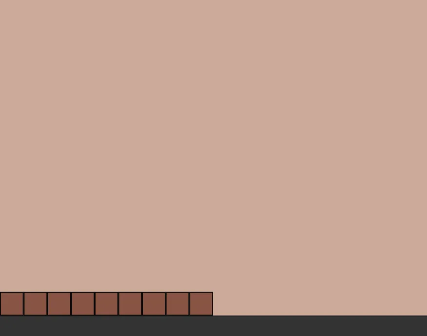
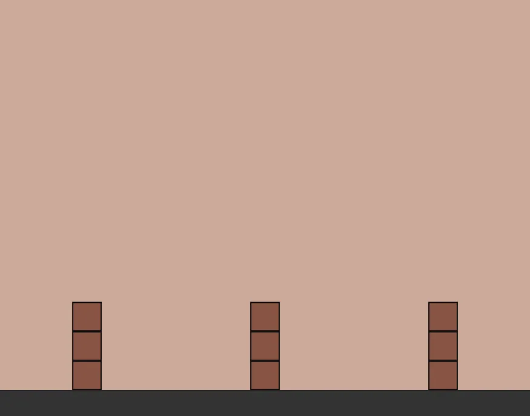

# Flex direction, Hover, hierachy selectors and responsive design

## Section: Flex direction

### Summary

- By default, the flexbox positions its children horizontally. However, you can change this behavior using the `flex-direction` property:    
```css
.container {
    display: flex;
    flex-direction: column;
}
```
- This property accepts two values: `row` (which positions the elements side by side, which is the default value) and `column` (which positions them one below the other, vertically)
- **Important**: when you change from `row` to `column`, the `justify-content` and `align-items` properties switch roles! So:
    - If `flex-direction: row;` (which is the default): `justify-content` will distribute the elements horizontally and `align-items` vertically
    - If `flex-direction: column;`: `justify-content` will distribute the elements vertically and `align-items` horizontally
- In summary: `justify-content` is the one who aligns the elements on the **same axis as `flex-direction`** and `align-items` on the opposite axis

### Project: Stock loading
Hey, new stock arrived at the factory. The delivery guy was pretty tired, so he just left everything in a corner, leaving it like this:

This way, too much factory space is being used. Let's organize this before the supervisor arrives.

- Keep the boxes standing upright
- Keep the boxes touching the floor
- Keep space between the boxes, without having them touching the edges

```html
<!DOCTYPE html>
<html lang="en">
  <head>
    <meta charset="UTF-8" />
    <meta http-equiv="X-UA-Compatible" content="ie=edge" />
    <title>Stock loading</title>
    <link rel="stylesheet" href="style.css" />
  </head>
  <body>
    <div class="wall">
      <div class="boxes">
        <div class="box"></div>
        <div class="box"></div>
        <div class="box"></div>
      </div>
      <div class="boxes">
        <div class="box"></div>
        <div class="box"></div>
        <div class="box"></div>
      </div>
      <div class="boxes">
        <div class="box"></div>
        <div class="box"></div>
        <div class="box"></div>
      </div>
    </div>
    <div class="floor"></div>
  </body>
</html>
```

## Section: Hover

### Summary

- To change a style when the user passes the mouse over an element, we can use the :hover selector, like this:
```css
.item {
	background: red;
}

.item:hover {
	background: blue; /* Mudará de vermelho pra azul quando o mouse estiver em cima do elemento */
}
```
​- A way to reduce the amount of classes in your HTML is to explore more advanced selectors.
- For example, we can use the hierarchy selectors, like this:
```css
/* Instead of creating classes like this: */

.menu { ... }
.item-menu { ... }

/* You can simplify it like this: */

.menu { ... }
.menu a { 
	/* Will apply to all `<a>` elements that are inside `.menu` */ 
}
```
- In the example above, all `<a>` elements inside `.menu` will receive the style.
- Even in the situation below, where the links are not direct children of the `.menu` div (since they are inside a `button` div as well), they will receive the style:
```html
<div class="menu">
	<div class="button">
		<a href="...">Link that will receive the style</a>
	</div>
	<div class="button">
		<a href="...">Link that will receive the style</a>
	</div>
	<div class="button">
		<a href="...">Link that will receive the style</a>
	</div>
</div>
```
- **Bonus**: Other useful selectors
- If you want to restrict it to only immediate children of `.menu`, you can use the `>` selector:
```css
.menu {}
.menu > a { 
	/* Will apply to all `<a>` elements that are immediate children of `.menu` */
}
```
- In this case, only the immediate children of `.menu` will receive the style:
```html
<div class="menu">
	<a href="...">Link that will receive the style</a>
	<div class="button">
		<a href="...">Link that will NOT receive the style</a>
	</div>
	<a href="...">Link that will receive the style</a>
</div>
```
- Some other interesting selectors:
```css
.menu a:first-child { } /* Only on the first `<a>` inside `.menu` */
.menu a:last-child { } /* Only on the last `<a>` inside `.menu` */
.menu a:nth-child(3) { } /* Only on the third `<a>` inside `.menu` */

.menu a:nth-child(odd) { } /* Only on the `<a>` elements in odd positions */
.menu a:nth-child(even) { } /* Only on the `<a>` elements in even positions */
```

### Project: Hover effect

- Add a `hover` effect to the elements with the class `.option` so that they get a `#f2f2f2` background when the mouse is over them
- Then, use the hierarchy selector technique to remove the `.option` and `.icon` classes from the code, making it a bit more concise and readable

```html
<!DOCTYPE html>
<html lang="en">
  <head>
    <meta charset="UTF-8" />
    <title>Hover effect</title>

    <style>
      body {
        background: #f2f2f2;
      }

      .container {
        width: 500px;
        background: #fff;
        border-radius: 10px;
        margin: 150px auto;
        box-shadow: 0 0 10px 0px rgba(0, 0, 0, 0.15);
        border: 1px solid #fff;
      }

      h1 {
        font-size: 18px;
        text-align: center;
        margin-top: 20px;
      }

      .options {
        display: flex;
        justify-content: space-around;
        flex-wrap: wrap;
        margin-top: 40px;
      }

      /* The classes .option and .icon can be removed and the styles applied 
         using the hierarchy selector */

      .option {
        border: 1px solid #aaaaaa;
        border-radius: 10px;
        width: 200px;
        height: 200px;
        display: flex;
        justify-content: center;
        align-items: center;
        margin-bottom: 20px;
        cursor: pointer;
      }

      .icon {
        width: 150px;
        height: 150px;
        border-radius: 50%;
      }

      .icon-1 {
        background-color: #03a9f4;
      }

      .icon-2 {
        background-color: #009688;
      }

      .icon-3 {
        background-color: #ff9800;
      }

      .icon-4 {
        background-color: #795548;
      }
    </style>
  </head>
  <body>
    <div class="container">
      <h1>Choose your favorite option:</h1>
      <div class="options">
        <div class="option">
          <div class="icon icon-1"></div>
        </div>
        <div class="option">
          <div class="icon icon-2"></div>
        </div>
        <div class="option">
          <div class="icon icon-3"></div>
        </div>
        <div class="option">
          <div class="icon icon-4"></div>
        </div>
      </div>
    </div>
  </body>
</html>
```

## Section: Meta Viewport and Media Query

### Summary

- By default, mobile browsers try to squeeze the content of our site to fit on the screen. Usually, this is not what you want. You can change this behavior using the meta tag below:    
```html
<meta name="viewport" content="width=device-width, initial-scale=1">
```
- A next step to make a site responsive is to change its styles when the screen is small. You can do this using the CSS Media Query feature, like this:    
```css
div {
    width: 900px;
}

@media (max-width: 600px) {
    div {
        width: 100%; /* Only on screens smaller than 600px, the width will be 100% instead of 900px */
    }
}
``` 
- To remove an element from the screen, you can use the `display: none;` property. For example, we can remove a menu when the user is on a mobile:
```css
.menu {
	// ...
}

@media (max-width: 600px) {
	.menu {
		display: none;
	}
}
```

### Project: Continuous improvements

The menu on the page below is positioned on the left side of the screen.

Over time, the site administrator received several complaints that, on mobile, the navigation menu is too far from the user's fingers.
To solve the problem, you were hired to place the menu in the following way when the screen is less than `600px` wide:

In other words, on desktop the menu had **100px of width** and **100% of height**, while on mobile it had **100% of width** and **80px of height**.
In addition, before the menu was next to the content div. Now it sits on top of it. (Tip: you can use **flex-direction** to solve this!)
**Important**: don't forget to add the meta tag to prevent the browser from zooming when on mobile.

```html
<!DOCTYPE html>
<html lang="en">
  <head>
    <meta charset="UTF-8" />
    <title>Continuous improvements</title>
    <link rel="stylesheet" href="reset.css" />
    <style>
      .top {
        background: cyan;
        height: 60px;
      }

      .container {
        height: 600px;
        display: flex;
      }

      .menu {
        height: 100%;
        width: 100px;
        background: dimgrey;
      }

      .content {
        width: 100%;
        height: 100%;
        background: lightgrey;
      }
    </style>
  </head>
  <body>
    <div class="top"></div>
    <div class="container">
      <div class="menu"></div>
      <div class="content"></div>
    </div>
  </body>
</html>
```