# Flexbox practice

## Tips

- Selecting IDs

To select an element with a specific id in CSS, we should use the following syntax `#name-of-id`. For example, to select the following element: `<div id="box">` we should write `#box` in our css.

## Exercises

### Exercise 1
The bottom box has fragile content and cannot be stacked.
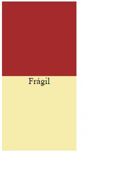
Put the boxes side by side on the page below.

```html
<!DOCTYPE html>
<html>
  <head>
    <meta charset="utf-8">
    <style>
      .box {
        width: 300px;
        height: 300px;
        background-color: brown;
      }

      .fragile {
        font-size: 36px;
        text-align: center;
        background-color: #F6ECAB;
      }
    </style>
  </head>
  <body>
    <div id="stack">
      <div class="box"></div>
      <div class="box fragile">Fragile</div>
    </div>
  </body>
</html>
```

### Exercise 2
The boxes below never stack.

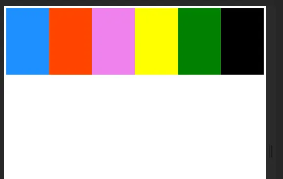

Make them responsive according to the page width, stacking them.

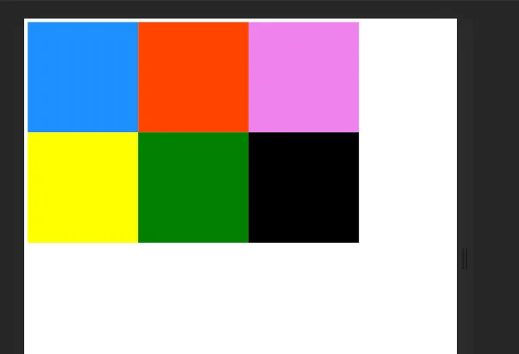

```html
<!DOCTYPE html>
<html>
  <head>
    <meta charset="utf-8">
    <style>
      body {
        height: 500px;
      }

      #stack {
        display: flex;
        height: 500px;
      }

      .box {
        height: 250px;
        width: 250px;
      }

      #box-1 {
        background-color: dodgerblue;
      }
    
      #box-2 {
        background-color: orangered;
      }
      #box-3 {
        background-color: violet;
      }
      #box-4 {
        background-color: yellow;
      }
      #box-5 {
        background-color: green;
      }
      #box-6 {
        background-color: black;
      }

    </style>
  </head>

  <body>
    <div id="stack">
      <div class="box" id="box-1"></div>
      <div class="box" id="box-2"></div>
      <div class="box" id="box-3"></div>
      <div class="box" id="box-4"></div>
      <div class="box" id="box-5"></div>
      <div class="box" id="box-6"></div>
    </div>
  </body>
</html>
```

### Exercise 3
The business is growing and there is no space in the warehouse. 

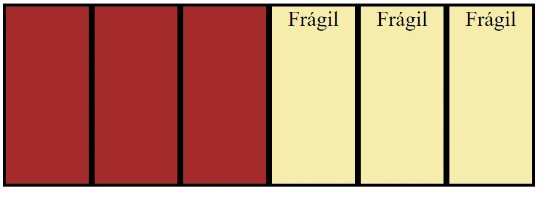

We don't want to crush the boxes, **without changing the HTML**, make the fragile boxes stack on top of the normal boxes, not below. (Hint: search other possible values for `flex-wrap` and try them)

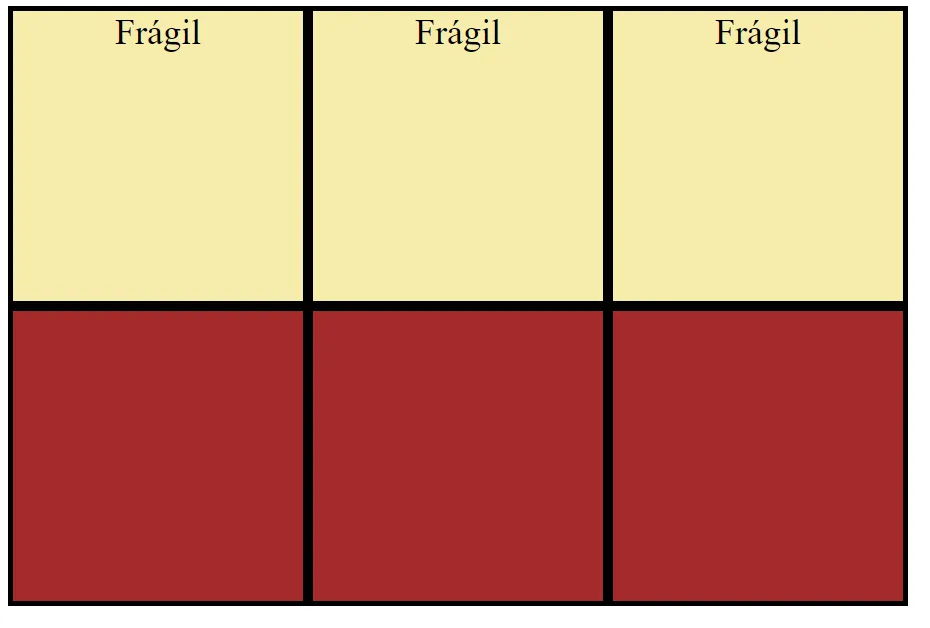

```html
<!DOCTYPE html>
<html>
<head>
  <style>
    #stack {
      display: flex;
      width: 900px;
    }
    
    .box {
      width: 290px;
      height: 290px;
      background-color: brown;
      border: 5px solid black;
    }

    .fragile {
      font-size: 36px;
      text-align: center;
      background-color: #F6ECAB;
    }
  </style>
</head>
<body>
  <div id="stack">
    <div class="box"></div>
    <div class="box"></div>
    <div class="box"></div>
    <div class="box fragile">Fragile</div>
    <div class="box fragile">Fragile</div>
    <div class="box fragile">Fragile</div>
  </div>
</body>
</html>
```

### Exercise 4

It's a cold day, the penguins need to be very close to each other and the farthest from the two ice walls ❄️.

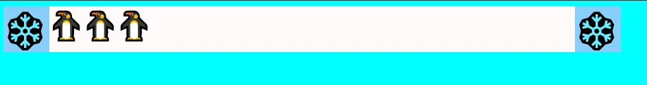

Without changing the HTML, help them to protect themselves from the ice. ❄️

```html
<!DOCTYPE html>
<html>
  <head>
    <meta charset="utf-8">
    <style>
      body {
        background-color: aqua;
      }

      .container {
        display: flex;
        width: 900px;
      }
      
      .ice {
        font-size: 50px;
        background-color: lightskyblue;
      }

      .space {
        width: 650px;
        background-color: snow;
        display: flex;
      }

      .penguin {
        font-size: 40px;
      }
    </style>
  </head>
  <body>
    <div class="container">
      <div class="ice">❄️</div>
      <div class="space">
        <div class="penguin">🐧</div>
        <div class="penguin">🐧</div>
        <div class="penguin">🐧</div>
      </div>
      <div class="ice">❄️</div>
    </div>
  </body>
</html>
```

### Exercise 5

It's a cold day, the penguins need to be very close to each other and the farthest from the ice wall ❄️.

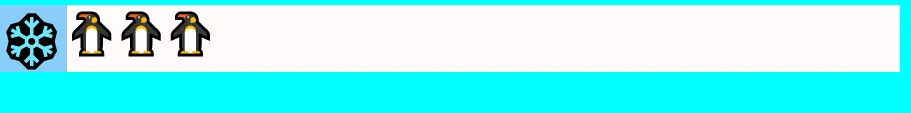

Help them to protect themselves from the ice. ❄️

```html
<!DOCTYPE html>
<html>
  <head>
    <meta charset="utf-8">
    <style>
      body {
        background-color: aqua;
      }

      .container {
        display: flex;
        width: 900px;
      }
      
      .ice {
        font-size: 50px;
        background-color: lightskyblue;
      }

      .space {
        width: 650px;
        background-color: snow;
        display: flex;
      }

      .penguin {
        font-size: 40px;
      }
    </style>
  </head>
  <body>
    <div class="container">
      <div class="ice">❄️</div>
      <div class="space">
        <div class="penguin">🐧</div>
        <div class="penguin">🐧</div>
        <div class="penguin">🐧</div>
      </div>
    </div>
  </body>
</html>
```

### Exercise 6

It's not good to leave explosives too close to each other. Leave them as far apart as possible.


```html
<!DOCTYPE html>
<html>
  <head>
    <meta charset="utf-8">
    <style>
      body {
        background-color: gray;
      }

      .container {
        display: flex;
        width: 900px;
      }

      .tnt {
        font-size: 40px;
        color: orange;
        width: 100px;
        height: 100px;
        background-color: orangered;
        border: 5px solid red;
        text-align: center;
      }
    </style>
  </head>
  <body>
    <div class="container">
      <div class="tnt">TNT</div>
      <div class="tnt">TNT</div>
      <div class="tnt">TNT</div>
      <div class="tnt">TNT</div>
      <div class="tnt">TNT</div>
    </div>
  </body>
</html>
```

### Exercise 7

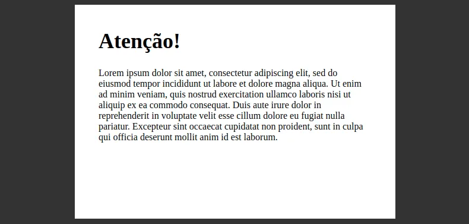

The content of the card above should be centered vertically. Make adjustments to the page code so that it is in this way:

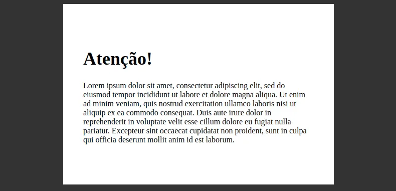

```html
<!DOCTYPE html>
<html>
  <head>
    <meta charset="utf-8">
    <style>
      body {
        background-color: #333;
        display: flex;
        justify-content: center;
      }

      .alert {
        width: 540px;
        height: 360px;
        background-color: #FFF;
      }

      .title {
        font-size: 36px;
        font-weight: bold;
      }

      .content {
        margin: 40px;
      }
    </style>
  </head>
  <body>
    <div class="alert">
      <div class="content">
        <h1 class="title">Attention!</h1>
        <p>Lorem ipsum dolor sit amet, consectetur adipiscing elit, sed do eiusmod tempor incididunt ut labore et dolore magna aliqua. Ut enim ad minim veniam, quis nostrud exercitation ullamco laboris nisi ut aliquip ex ea commodo consequat. Duis aute irure dolor in reprehenderit in voluptate velit esse cillum dolore eu fugiat nulla pariatur. Excepteur sint occaecat cupidatat non proident, sunt in culpa qui officia deserunt mollit anim id est laborum.</p>
      </div>
    </div>
  </body>
</html>
```

### Exercise 8

The developers of Nintendo were recreating Super Mario Bros. 1 and made a mistake when developing the ladder, making it upside down

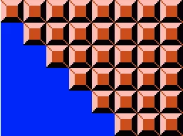

Now he can't reach the flag

Make the adjustments necessary so that the ladder is in the correct orientation, as shown in the image below:

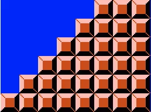

Use the image `mario-block.png` on from this folder.
```html
<!DOCTYPE html>
<html>
  <head>
    <meta charset="UTF-8" />
    <style>
      .container {
        background-color: blue;
        width: 256px;

        display: flex;
      }

      .columns {
        text-align: center;
      }

      .icon {
        height: 32px;
      }
    </style>
  </head>
  <body>
    <div class="container">
      <div class="columns">
        <div class="icon"></div>
      </div>
      <div class="columns">
        <div class="icon"></div>
        <div class="icon"></div>
      </div>
      <div class="columns">
        <div class="icon"></div>
        <div class="icon"></div>
        <div class="icon"></div>
      </div>
      <div class="columns">
        <div class="icon"></div>
        <div class="icon"></div>
        <div class="icon"></div>
        <div class="icon"></div>
      </div>
      <div class="columns">
        <div class="icon"></div>
        <div class="icon"></div>
        <div class="icon"></div>
        <div class="icon"></div>
        <div class="icon"></div>
      </div>
      <div class="columns">
        <div class="icon"></div>
        <div class="icon"></div>
        <div class="icon"></div>
        <div class="icon"></div>
        <div class="icon"></div>
        <div class="icon"></div>
      </div>
      <div class="columns">
        <div class="icon"></div>
        <div class="icon"></div>
        <div class="icon"></div>
        <div class="icon"></div>
        <div class="icon"></div>
        <div class="icon"></div>
      </div>
      <div class="columns">
        <div class="icon"></div>
        <div class="icon"></div>
        <div class="icon"></div>
        <div class="icon"></div>
        <div class="icon"></div>
        <div class="icon"></div>
      </div>
    </div>
  </body>
</html>
```

### Exercise 9

Mario is trapped! He has done everything he can, but the cloud is always chasing him and preventing him from reaching the pole

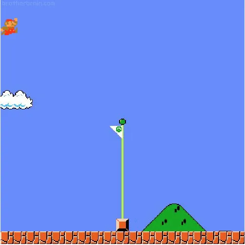

Make adjustments to the page so that Mario reaches the pole, as shown in the image below:

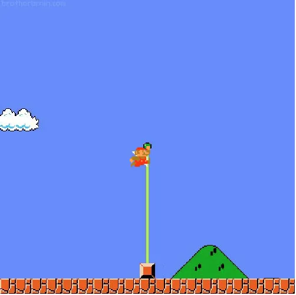

(note that the pole is in the center of the image)

Use the images `mario-jumping.png` and `mario-pole-center.jpg` from this folder.

```html
<!DOCTYPE html>
<html lang="en">
  <head>
    <meta charset="UTF-8" />
    <meta name="viewport" content="width=device-width, initial-scale=1.0" />
    <title>Exercise</title>
    <style>
      .game {
        background-image: url("mario-pole-center.jpg");
        width: 500px;
        height: 500px;

        display: flex;
        /* make your adjustments here */
      }
    </style>
  </head>
  <body>
    <div class="game">
      <div class="mario">
        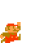
      </div>
    </div>
  </body>
</html>
```

## Bonus
[Flexbox Froggy](https://flexboxfroggy.com/)

