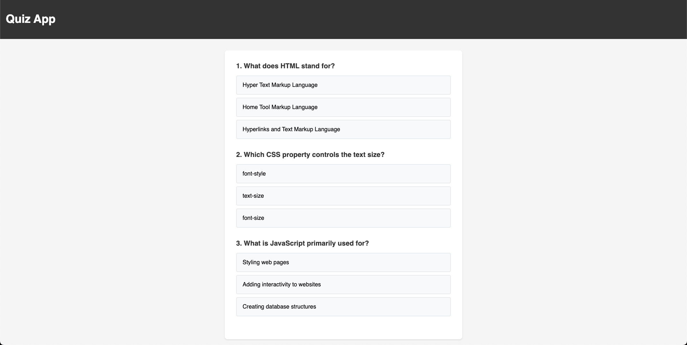

# Main Project

## Interactive Quiz App

[https://mdnm.github.io/development-101/](https://mdnm.github.io/development-101/)

### Tech Stack
- HTML
- CSS
- JavaScript (Vanilla)

### Objective
- [ ] Create an interactive quiz application that tests users on web development fundamentals
- [ ] Implement immediate feedback when users select answers (correct answers should turn green, wrong answers should turn red)
- [ ] Show the correct answer when a wrong answer is selected
- [ ] Track and display the user's score at the end of the quiz
- [ ] Make the interface responsive for both desktop and mobile devices
- [ ] Structure the JavaScript code to handle:
  - DOM manipulation
  - Event handling
  - Data management (quiz questions and answers)
  - Score tracking
  - User feedback