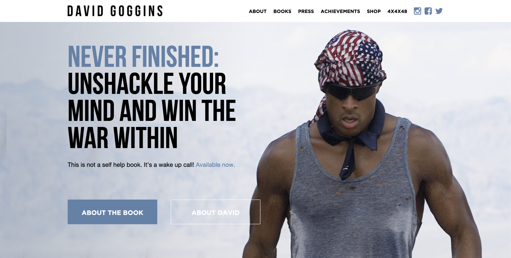
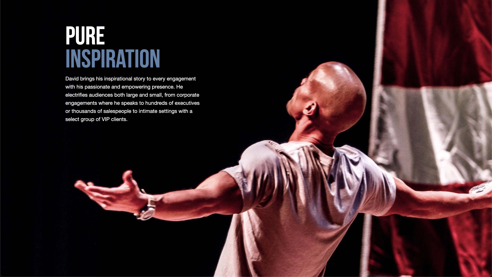
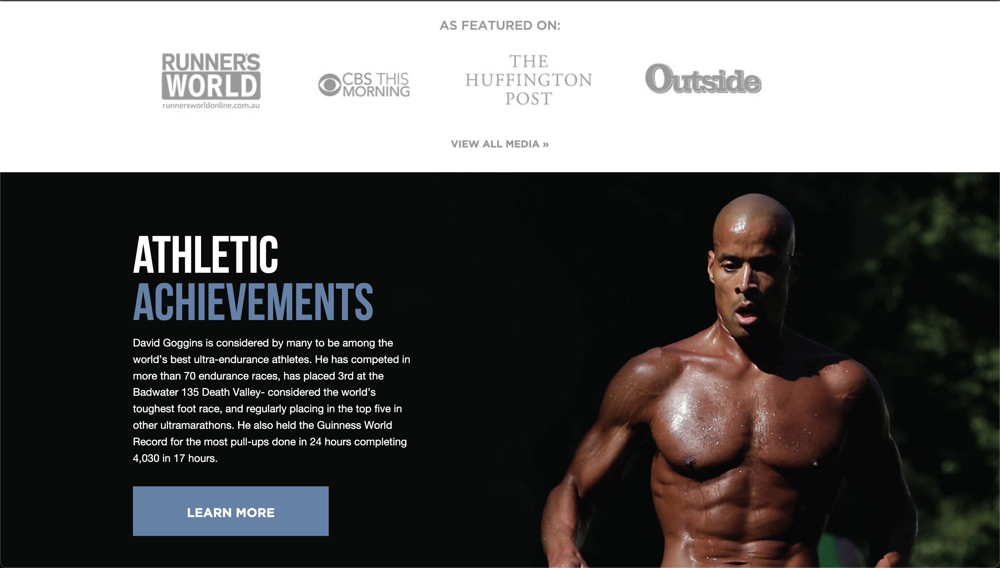
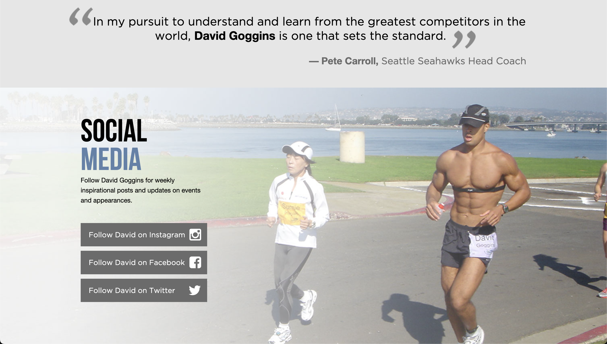
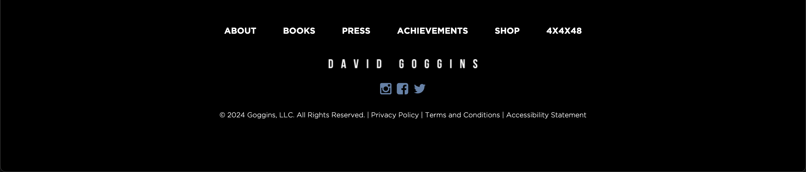
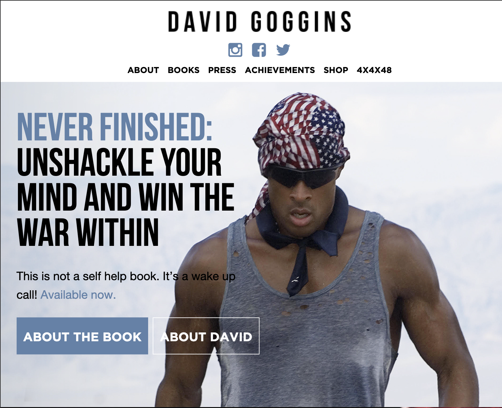
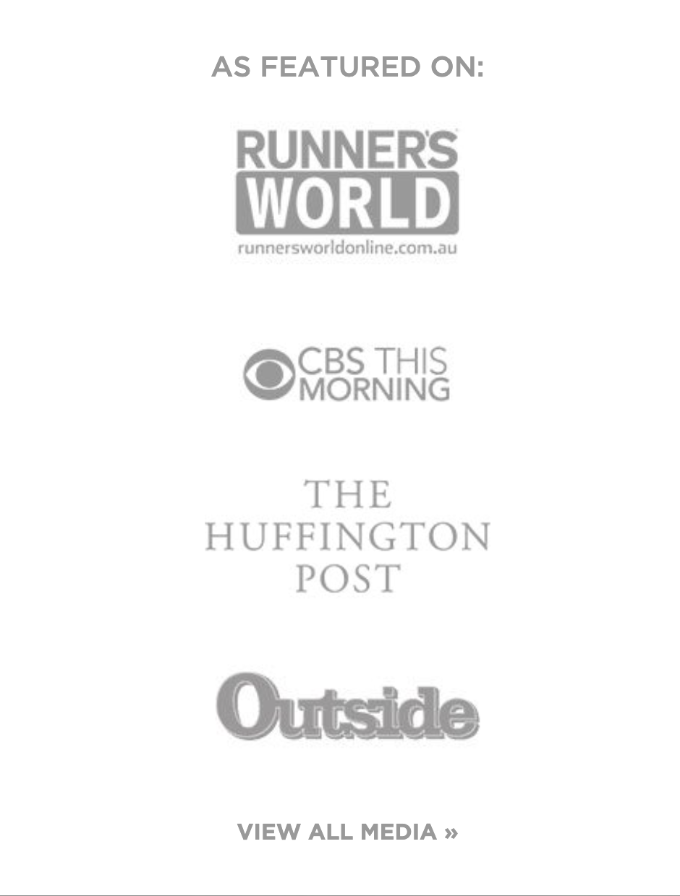
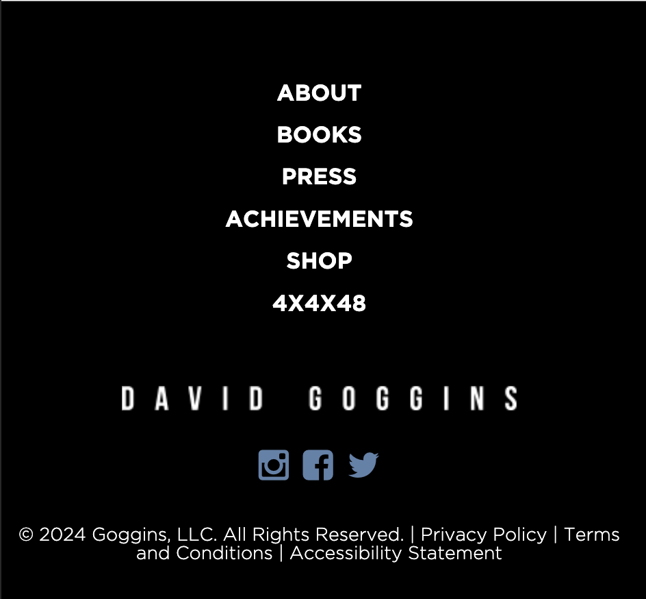

# Main Project

## David Goggins Clone

Desktop view

Mobile view

### Tech Stack
- HTML
- CSS

### Objective
- [ ] Create a page with the same style and content as the screenshots above. You can approximate the style like colors, fonts, spacing, etc. Checkout the source here: [https://davidgoggins.com/](https://davidgoggins.com/)
- [ ] Use icons from [Ionicons](https://ionic.io/ionicons)
- [ ] Make sure the page is responsive to the user's device width, as per the mobile view screenshots above. The Navbar, featured and footer should change to adapt to the screen size.
- [ ] **Bonus** (optional): Implement the other pages of the website.

