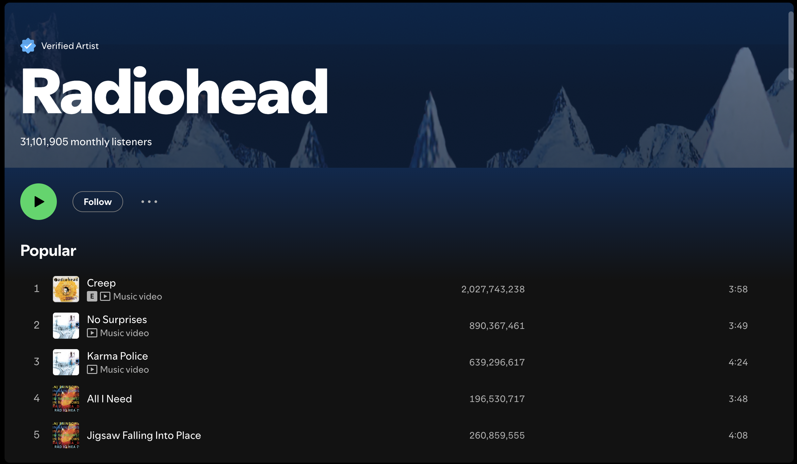

# Main Project

## Spotify Clone

### Tech Stack
- HTML
- CSS

### Objective
- [ ] Create a page with the same style and content as the screenshot above. You can approximate the style like colors, fonts, spacing, etc.
- [ ] Make sure the songs and the artist title are links to the Spotify song and artist page respectively.
- [ ] Use a font from [Google Fonts](https://fonts.google.com/)

